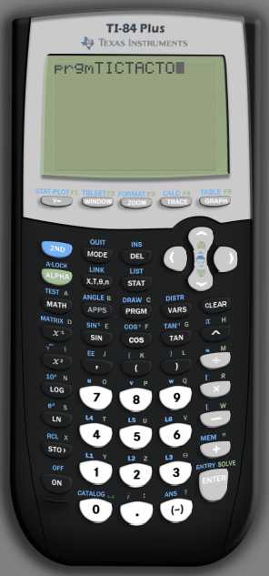

# TI84-TicTacToe
Implementation of TicTacToe for the TI-84 calculator (an old hobby project).

## Demo

## Source files
`TICTACTOE.txt` has the TI84 intepretted language code.

`TICTACTOE.8xp` has the TI84 compiled code.

You can recompile the source here: https://www.cemetech.net/sc/
